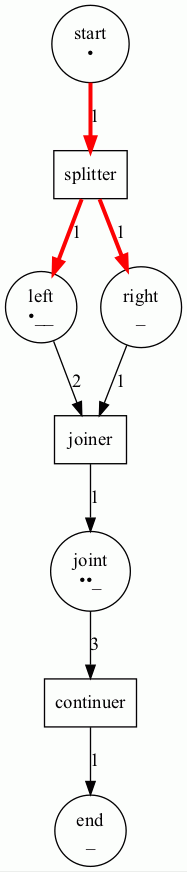

# Castanet is a Colored Petri Net for GRPC/HTTP orchestration (e.g. FS2-GRPC or HTTP4S)

Formally Petri Nets consist of Places (circles), Transitions (rectangles) and Arcs (arrows) that connect the Places to Transitions and Transitions to Places.
It is well suited for describing the orchestration of concurrent processes.

From the Castanet perspective, Petri Nets are directed graphs consisting of Places(States), Transitions(Services) and Arcs(Guards). It models state-transitions of (concurrent) processes.
It is easy to see (if you are that way inclined) that Petri Nets form a Category of Petri  
Protobuf definitions specify the service and message format for GRPC services.
An GRPC/HTTP call is assumed to be stateless, yet often there is a need to have service calls handled within the context of a state machine (FSM)

Castanet constructs a PetriNet using a builder-pattern

```scala
val p1 = Place(1, "start", 1)
val p2 = Place(2, "left", 3)
val p3 = Place(3, "right", 1)
val p4 = Place(4, "joint", 3)
val p5 = Place(5, "end", 1)

val t1 = Transition(6, "splitter", (l: LinkableElement) => println(l))
val t2 = Transition(7, "joiner", (l: LinkableElement) => println(l))
val t3 = Transition(8, "continuer", (l: LinkableElement) => println(l))

val b1 = PetriNetBuilder().addAll(ListSet(p1, p2, p3, p4, p5))
val b2 = n.addAll(ListSet(t1, t2, t3))
val b3 = n2
  .add(Weighted(1, 6, 1))
  .add(Weighted(6, 2, 1))
  .add(Weighted(6, 3, 1))
  .add(Weighted(2, 7, 2))
  .add(Weighted(3, 7, 1))
  .add(Weighted(7, 4, 1))
  .add(Weighted(4, 8, 3))
  .add(Weighted(8, 5, 1))
val petrinet = b3.build()
```

State is attributed to the Petri Net through Markers that associate a BitVectors(scodec.bits) with a specific Place

```scala
val m1 = Markers(pn)
val m2 = m1.setMarker(Marker(1, bin"1"))
val m3 = m2.setMarker(Marker(2, bin"1")).setMarker(Marker(4, bin"11"))
```


For a given set of Markers (current state) the PetriNet can be asked to step through to the next state (set of markers) as indicated by the guards placed on the Arcs that join Places and Transitions. 

```scala
val m6 = petrinet.step(m3, true, 1)
```



The resulting state can be visualized with a PetriPrinter.

```scala
PetriPrinter(fileName = "petrinet1", petriNet = petrinet).print(Option(m3))
```


